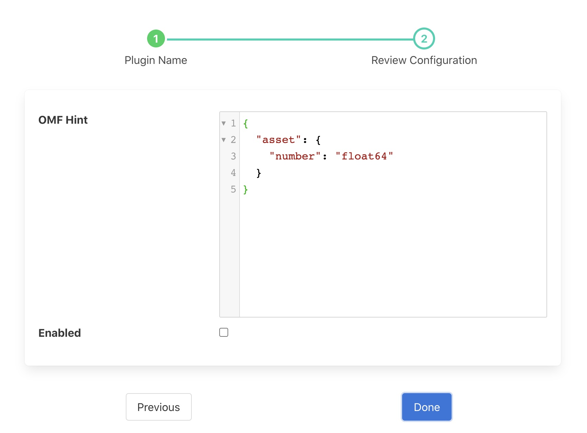

.. Images

.. |OMFNorth| raw:: html

   <a href="../fledge-north-OMF/index.html">OMF North</a>

OMF Hint Filter
===============

The *fledge-filter-omfhint* filter allows hints to be added to assets within Fledge that will be used by the |OMFNorth| plugin. These hints allow for individual configuration of specific assets within the OMF plugin. 

A OMF hint filter may be added to either a south service or a north task. In a south service it will be adding data for just those assets that originate in that service. In a north task it causes OMF hints to be added to all assets that the Fledge is sending to the upstream system, it would normally only be used in a north that was using the OMF plugin, however it could be used in a north that is sending data to another Fledge that then forwards to OMF.

To add an OMF hints filter:

  - Click on the Applications add icon for your service or task.

  - Select the *omfhint* plugin from the list of available plugins.

  - Name your OMF hint filter.

  - Click *Next* and you will be presented with the following configuration page

+-----------+
| |omfhint| |
+-----------+

  - Enter your OMF Hints in the JSON editor shown. You may add multiple hints for multiple assets in a single filter instance. See `OMF Hint data`_.

  - Enable the filter and click on *Done* to activate it.

OMF Hint data
-------------

OMF Hints comprise of an asset name which the hint applies and a JSON document that is the hint. A hint is a name/value pair: the name is the hint type and the value is the value of that hint.

The asset name may be expressed as a regular expression, in which case the hint is applied to all assets that match that regular expression.

The following hint types are currently supported by |OMFNorth|:

  - *integer*: The format to use for integers, the value is a string and  may be any of the PI Server supported formats; int64, int32, int16, uint64, uint32 or uint16

  - *number*: The format to use for numbers, the value is a string and  may be any of the PI Server supported formats; float64, float32 or float16

  - *typeName*: Specify a particular type name that should be used by the plugin when it generates a type for the asset. The value of the hint is the name of the type to create.

  - *tagName*: Specify a particular tag name that should be used by the plugin when it generates a tag for the asset. The value of the hint is the name of the tag to create.

  - *type*: Specify a pre-existing type that should be used for the asset. In this case the value of the hint is the type to use. The type must already exist within your PI Server and must be compatible with the values within the asset.

  - *datapoint*: Specifies that this hint applies to a single datapoint within the asset. The value is a JSON object that contains the name of the datapoint and one or more hints.

  - *AFLocation*: Specifies a location in the OSIsoft Asset Framework for the asset.
    This hint is fully documented in the |OMFNorth| plugin page.

  - *source*: Specifies the data source for the asset, the default data source is set to *Fledge*.

  - *LegacyType*: This defines the way OMF types are used and provides a mechanism to use types in the way the initial OMF plugin used them. Unless you have reason to force this older behaviour it is recomended to not use this hint. This hint is fully documented in the |OMFNorth| plugin page.

  - *uom*: Define the unit of mesaure for the datapoint. This can only appear within datapoints and not for assets.

  - *minimum*: Define the minimum value for a datapoint. This can only appear within datapoints and not for assets.

  - *maximum*: Define the maximum value for a datapoint. This can only appear within datapoints and not for assets.

  - *interpolation*: Define the interpolation value for a datapoint. This can only appear within datapoints and not for assets. Interpolation may be set to one of *continuous*, *discrete*, *stepwisecontinuousleading*, and *stepwisecontinuousfollowing*.

The following example shows a simple hint to set the number format to use for all numeric data within the asset names *supply*.

.. code-block:: JSON

  {
    "supply": {
        "number": "float32"
        }
  }

To apply a hint to all assets, the single hint definition can be used with a regular expression.

.. code-block:: JSON

  {
    ".*": {
        "number": "float32"
        }
  }

Regular expressions may also be used to select subsets of assets, in the following case only assets with the prefix OPCUA will have the hint applied.

.. code-block:: JSON

  {
    "OPCUA.*": {
        "number": "float32"
        }
  }

To apply a hint to a particular data point the hint would be as follows

.. code-block:: JSON

  {
    "supply": {
        "datapoint" :
            {
                "name": "frequency"
                "integer": "uint16"
            }
        }
  }

This example sets the datapoint *frequency* within the *supply* asset to be stored in the PI server as a uint16.

Datapoint hints can be combined with asset hints

.. code-block:: JSON

  {
    "supply": {
        "number" : "float32",
        "datapoint" :
            {
                "name": "frequency"
                "integer": "uint16"
            }
        }
  }

In this case all numeric data except for *frequency* will be stored as float32 and *frequency* will be stored as uint16.

If more than one datapoint within a reading is required to have OMF hints
attached to them this may be done by using an array as a child of the
datapoint item.

.. code-block:: JSON

   {
   	"motor4": {
   		"OMFHint": {
   			"datapoint": [{
   					"name": "voltage",
   					"number": "float32",
   					"uom": "volt"
   				},
   				{
   					"name": "current",
   					"number": "uint32",
   					"uom": "milliampere"
   				}
   			]
   		}
   	}
   }

The example above attaches a number hint to both the voltage and current
datapoints and to the current datapoint. It assigns a unit of measure
of milliampere. The unit of measure for the voltage is set to be volts.

